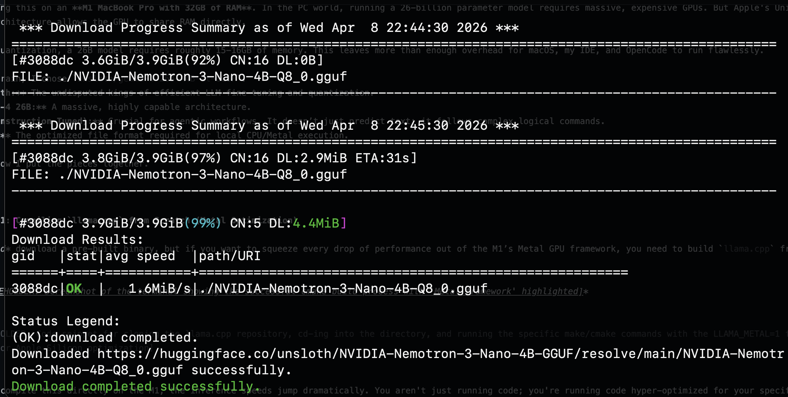
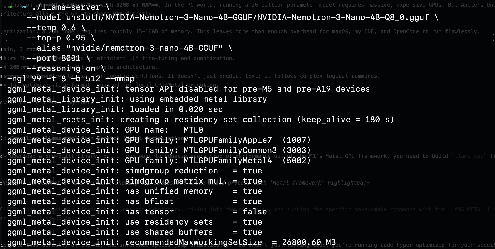
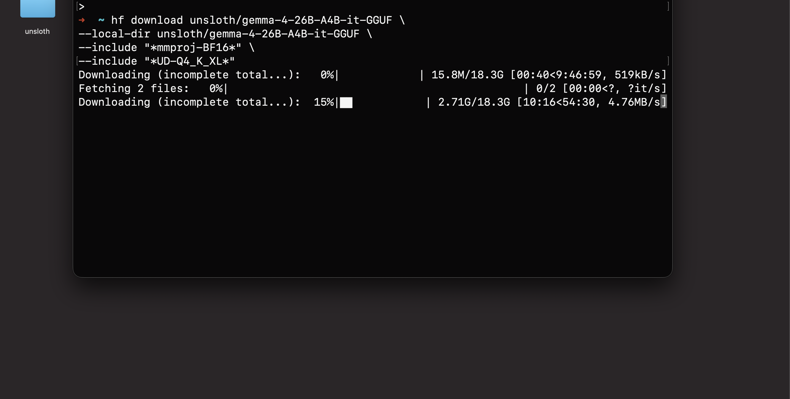
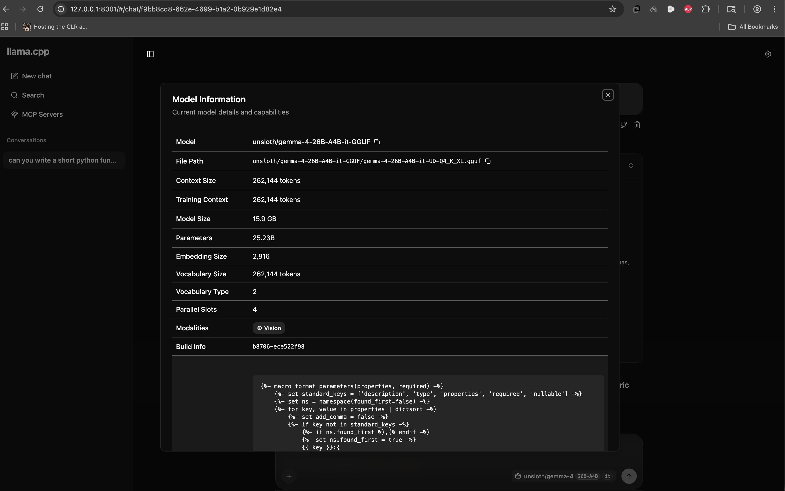
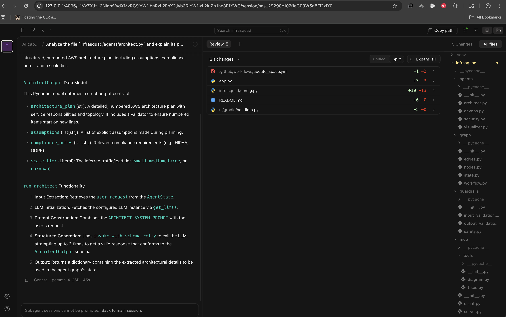

> **TL;DR** - I compiled `llama.cpp` with Metal GPU acceleration on an M1 Mac, loaded Google's Gemma-4 26B via Unsloth's quantization, and wired it to OpenCode for a fully agentic, offline coding workflow. Total API cost: **$0**. Data sent to the cloud: **0 bytes**. This post is the exact, reproducible blueprint.

The cloud is phenomenal - until you're on a 12-hour flight, dealing with rate limits, or working on proprietary code you *absolutely cannot* send to an external API.

For the last few weeks, I've been obsessed with a single question: **How close can we get to a GPT-4 level agentic coding experience, running 100% locally, with zero internet connection?**

The answer surprised me. With Apple's Unified Memory, the relentless optimization of `llama.cpp`, and the bleeding-edge quantizations from the Unsloth team, I turned my M1 MacBook Pro (32GB RAM) into an offline, autonomous coding powerhouse.

What follows is the exact blueprint: how I built `llama.cpp` from scratch, loaded Google's massive [**Gemma-4**](https://deepmind.google/models/gemma/gemma-4/) instruction-tuned model, and wired it to [**OpenCode**](https://opencode.ai/docs/) for a fully agentic, offline development loop. Every command is copy-pasteable. Every decision is explained.

---

## The Hardware & The Brain: Why This Works

I'm running this on an **M1 MacBook Pro with 32GB of RAM**. In the PC world, running a 26-billion parameter model requires massive, expensive GPUs. But Apple's Unified Memory architecture allows the GPU to share RAM directly.

At a Q4 quantization, a 26B model requires roughly 15–16GB of memory (~24GB is ideal). This leaves more than enough overhead for macOS, my IDE, and OpenCode to run flawlessly.

For the brain, I chose [**unsloth/gemma-4-26B-A4B-it-GGUF**](https://huggingface.co/unsloth/gemma-4-26B-A4B-it-GGUF) after reviewing the [hardware requirements](https://unsloth.ai/docs/models/gemma-4#hardware-requirements) for Gemma-4:

| Component | Why It Matters |
|:---|:---|
| **Unsloth** | The leading framework for efficient LLM quantization, with recent bugfixes not yet present in the [ggml-org](https://huggingface.co/ggml-org/gemma-4-26B-A4B-it-GGUF) or [Google](https://huggingface.co/google/gemma-4-26B-A4B-it) releases at the time of writing. |
| **Gemma-4 26B** | A massive, highly capable architecture from Google DeepMind. |
| **Instruction-Tuned (it)** | Crucial for agentic workflows - the model follows complex logical commands, not just predicts text. |
| **GGUF** | The optimized file format required for local CPU/Metal execution via `llama.cpp`. |

---

## Prerequisites

Before diving in, make sure you have the following installed. Every tool below is available through Homebrew or pip - no manual compilation required beyond `llama.cpp` itself.

```bash
# Xcode Command Line Tools (required for cmake, git, and Metal framework headers)
xcode-select --install

# Core build dependencies
brew install cmake libomp

# Hugging Face CLI for model downloads
pip install huggingface_hub hf_transfer

# Parallel download engine (optional, but strongly recommended for large models)
brew install aria2

# OpenCode - the agentic coding orchestrator
brew install anomalyco/tap/opencode
```

With these in place, every step below should work on a clean macOS install.

---

## Step 1: Compiling `llama.cpp` from Scratch (Metal Optimization)

You *could* download a pre-built binary, but if you want to squeeze every drop of performance out of the M1's Metal GPU framework, you need to build `llama.cpp` from source.

```bash
git clone https://github.com/ggml-org/llama.cpp.git
cd llama.cpp
cmake -B build -DGGML_METAL=ON
cmake --build build --config Release -j$(sysctl -n hw.ncpu)
```

The key flag is `-DGGML_METAL=ON`, which tells the build system to compile with Apple's Metal GPU framework. The `-j$(sysctl -n hw.ncpu)` parallelizes the build across all available CPU cores on your Mac.

When you compile this directly on the M1, the inference speeds jump dramatically. You aren't just running code; you're running code hyper-optimized for your specific silicon.

After the build finishes, the binaries end up buried inside `llama.cpp/build/bin/`. Rather than typing that full path every time, I created symlinks in my project root to keep commands clean:

```bash
ln -s ./llama.cpp/build/bin/llama-cli llama-cli
ln -s ./llama.cpp/build/bin/llama-server llama-server
```

`llama-cli` is the interactive chat interface for quick one-off prompts and testing directly from the terminal. `llama-server` is the HTTP inference server that exposes an OpenAI-compatible API endpoint, which is what we'll wire up to OpenCode later. Both are built from the same source tree, so they share identical Metal optimizations. With these symlinks in place, every command in the rest of this post uses `./llama-server` or `./llama-cli` from the project root without any path gymnastics.

### Validating the Build Before the Big Download

Before downloading the massive 18GB Gemma-4 model, I validated my entire pipeline end-to-end with a smaller model: [**NVIDIA Nemotron-3-Nano-4B**](https://huggingface.co/unsloth/NVIDIA-Nemotron-3-Nano-4B-GGUF) at Q8 quantization, weighing in at just 3.9GB. This is a workflow I strongly recommend. You want to confirm that `llama.cpp`, Metal acceleration, and your orchestrator all work together *before* committing to a multi-hour download.



Booting the server with the smaller model produced exactly what I wanted to see: the Metal framework fully initialized, unified memory detected, and all GPU families registered.



The server output confirmed `has unified memory = true`, `simdgroup matrix mul. = true`, and a `recommendedMaxWorkingSetSize` of roughly 26,800 MB. That last number is critical: it tells you how much VRAM the Metal backend can access, and on the M1, it is shared directly with system RAM. The pipeline was solid. Time to bring in the real model.

---

## Step 2: Pulling the Unsloth Gemma-4 Weights

Next, I needed the model. Because we are building an offline environment, we need to download the `.gguf` file locally.

I used the Hugging Face CLI to pull the specific Unsloth quantized model:

```bash
hf download unsloth/gemma-4-26B-A4B-it-GGUF \
  --local-dir unsloth/gemma-4-26B-A4B-it-GGUF \
  --include "*mmproj-BF16*" \
  --include "*UD-Q4_K_XL*"
```

The `--include` filters are important. The first pulls the multimodal vision projector (`mmproj-BF16`), giving the model the ability to understand images in addition to code. The second targets the `UD-Q4_K_XL` quantization specifically, which is the sweet spot for quality vs. memory on a 32GB machine: roughly 15.9GB on disk.



Fair warning: this is an 18.3GB download. Mine crawled at points, dropping to 519KB/s before eventually failing outright. The default `hf download` CLI does support resuming, but in practice the recovery is fragile on large files over unstable connections. I lost hours of progress to a single dropped transfer. This is precisely why I validated the pipeline with the Nemotron model first: you do not want to wait hours for a download only to discover your build is broken.

After watching `hf download` fail, I switched to [`hfd.sh`](https://gist.github.com/yeahjack/31f542ee6cab3c3e2c30594b7693cb22#file-hfd-sh) (Hugging Face Downloader) with `aria2c` as the download engine. Unlike the default CLI, `aria2c` handles resume reliably: it tracks per-segment progress in `.aria2` control files, so a dropped connection picks up exactly where it left off instead of restarting the entire file:

```bash
./hfd.sh unsloth/gemma-4-26B-A4B-it-GGUF \
  --local-dir unsloth/gemma-4-26B-A4B-it-GGUF \
  --include "*mmproj-BF16*" \
  --include "*UD-Q4_K_XL*" \
  --tool aria2c -x 16 -n 8
```

The `--tool aria2c` flag tells `hfd.sh` to use `aria2c` instead of the default downloader. The `-x 16` opens 16 connections per server and `-n 8` splits each file into 8 segments for parallel downloading, which dramatically improves throughput on large files. The `--include` filters work the same as before, targeting only the vision projector and the specific quantization we need.

---

## Step 3: Wiring the Brain to OpenCode (`opencode.json`)

Having a powerful local LLM is great, but chatting in a terminal isn't *agentic*. To actually write, edit, and debug code autonomously, I needed an orchestrator. Enter **OpenCode**.

OpenCode bridges the gap between the local LLM and your codebase. The key to making it work with a local `llama.cpp` server is configuring it as an [OpenAI-compatible provider](https://opencode.ai/docs/providers). The `llama-server` binary exposes an OpenAI-style `/v1/chat/completions` endpoint out of the box, and OpenCode's `@ai-sdk/openai-compatible` adapter speaks that protocol natively. This means no custom prompt templates, no manual `<start_of_turn>` token wrangling. The chat template baked into the GGUF file handles all of that automatically at the server level.

I created an `opencode.json` file at the root of my project:

```json
{
  "$schema": "https://opencode.ai/config.json",
  "provider": {
    "llama.cpp": {
      "npm": "@ai-sdk/openai-compatible",
      "name": "llama-server (local)",
      "options": {
        "baseURL": "http://127.0.0.1:8001"
      },
      "models": {
        "gemma-4:26b-a4b-it": {
          "name": "Gemma-4-26B-A4B-it (local)",
          "limit": {
            "context": 32000,
            "output": 65536
          }
        },
        "nvidia-nemotron-3-nano:4b": {
          "name": "NVIDIA-Nemotron-3-Nano-4B (local)",
          "limit": {
            "context": 32000,
            "output": 65536
          }
        }
      }
    }
  }
}
```

A few things to note:

- The `npm` field tells OpenCode to use the `@ai-sdk/openai-compatible` package for this provider.
- The `baseURL` points to `127.0.0.1:8001` where our `llama-server` will be listening.
- Context and output limits are set to 32,000 and 65,536 tokens respectively. The model supports up to 262K context, but keeping it at 32K is a practical ceiling for stable agentic sessions on 32GB of RAM.
- A second model, **NVIDIA Nemotron-3 Nano 4B**, is configured alongside Gemma-4 as a lightweight alternative for faster, less resource-intensive tasks.

Once the server was running with Gemma-4 loaded, I could verify everything through the llama.cpp web interface at `127.0.0.1:8001`:



25.23 billion parameters. A 262,144 token context window. Vision capability. All running from a file on my local disk, served over localhost. No cloud, no API key, no rate limit.

---

## Step 4: Full Offline Agentic Coding

With the model downloaded, `llama.cpp` compiled, and `opencode.json` locked in, I turned off my Wi-Fi.

**Zero internet. Zero API calls. Zero data leaving my machine.**

I spun up the local inference server and launched OpenCode:

```bash
# Terminal 1: Start the llama.cpp inference server with Gemma-4
./llama-server \
  --model unsloth/gemma-4-26B-A4B-it-GGUF/gemma-4-26B-A4B-it-UD-Q4_K_XL.gguf \
  --temp 0.6 \
  --top-p 0.95 \
  --alias "gemma-4-26B" \
  --port 8001 \
  -ngl 99 -t 8 -b 512 --mmap
```

If you're still validating your setup with Nemotron before committing to the full Gemma-4 model, you can swap in the smaller model with the same server flags:

```bash
# Alternative: Start with the lighter Nemotron model for testing
./llama-server \
  --model unsloth/NVIDIA-Nemotron-3-Nano-4B-GGUF/NVIDIA-Nemotron-3-Nano-4B-Q8_0.gguf \
  --temp 0.6 \
  --top-p 0.95 \
  --alias "nvidia/nemotron-3-nano-4B-GGUF" \
  --port 8001 \
  --reasoning on \
  -ngl 99 -t 8 -b 512 --mmap
```

Note the `--reasoning on` flag: Nemotron-3-Nano supports a built-in chain-of-thought reasoning mode that can improve output quality on complex tasks, particularly useful for validating that your agentic pipeline handles multi-step reasoning correctly before scaling up to Gemma-4.

```bash
# Terminal 2: Launch OpenCode
opencode
```

Here's what each server flag does:

| Flag | Purpose |
|:---|:---|
| `-ngl 99` | Offloads all model layers to the Metal GPU |
| `-t 8` | Sets 8 CPU threads for operations that fall back to CPU |
| `-b 512` | Controls batch size for prompt processing |
| `--mmap` | Memory-maps the model file, letting macOS manage paging efficiently without loading the entire 15.9GB into RAM upfront |
| `--temp 0.6` | Sampling temperature - slightly below default for more deterministic code generation |
| `--top-p 0.95` | Nucleus sampling threshold - keeps output focused while allowing some creativity |



The result was staggering. The Unsloth Gemma-4 26B model chewed through my context, understood the architecture of my local files, and began writing, diffing, and applying code. In the screenshot above, you can see it analyzing an `architect.py` file, breaking down its Pydantic data models, explaining the `run_architect` function flow, and proposing 5 Git changes across the project. The M1 pushed out tokens fast enough for real-time development. The footer confirms it: `gemma-4-26B`, 45 seconds for a full architectural analysis and code generation pass.

---

## What This Means

We are crossing a massive threshold.

For the past two years, the industry has assumed that truly capable AI agents require data centers. This experiment proves otherwise. A standard developer laptop, open-source inference via `llama.cpp`, aggressively optimized quantizations from Unsloth, and an agentic wrapper like OpenCode - that's the entire stack. **Absolute privacy and top-tier AI capability are no longer mutually exclusive.**

**For engineering teams**, this means sensitive codebases - defense, healthcare, fintech - can leverage AI coding assistants without a single byte crossing a network boundary. No SOC 2 reviews for yet another SaaS vendor. No data processing agreements. No trust boundaries to negotiate.

**For product and engineering leaders**, the math is compelling: zero marginal API cost per developer, zero vendor lock-in, and a capability that works identically on an airplane, in a SCIF, or behind an air-gapped network.

Your code is yours again. Your compute is yours again.

## What's Next

This setup is a foundation, not a ceiling. A few directions I'm actively exploring:

- **Larger context windows.** The 8K context limit in my `opencode.json` is conservative. With careful memory management and `llama.cpp`'s Flash Attention support, pushing to 32K+ on 32GB is feasible for longer agentic sessions.
- **Multi-model routing.** Running Nemotron for fast, lightweight tasks and Gemma-4 for heavy reasoning - switching between models based on task complexity, all locally.
- **Fine-tuning on proprietary code.** Unsloth supports LoRA and QLoRA fine-tuning. Training a domain-specific adapter on your team's codebase and merging it into the GGUF would give you a model that *thinks* in your architecture and naming conventions.
- **Team-wide access.** Embedding `llama-server` in a container behind your internal network so the entire team gets local AI without each developer maintaining their own build.

The tools are here. The models are capable enough. The only question is what you build with them.

---

*Written by [Amit Bhatt](https://linkedin.com/in/amit-bhatt) - [GitHub](https://github.com/sectumpsempra)*

*If you found this deep-dive useful, feel free to star the repo or share it with your team. Questions, improvements, or your own local AI stack? [Open an issue](https://github.com/sectumpsempra/sectumpsempra.github.io/issues) - I'd genuinely like to hear about it.*
